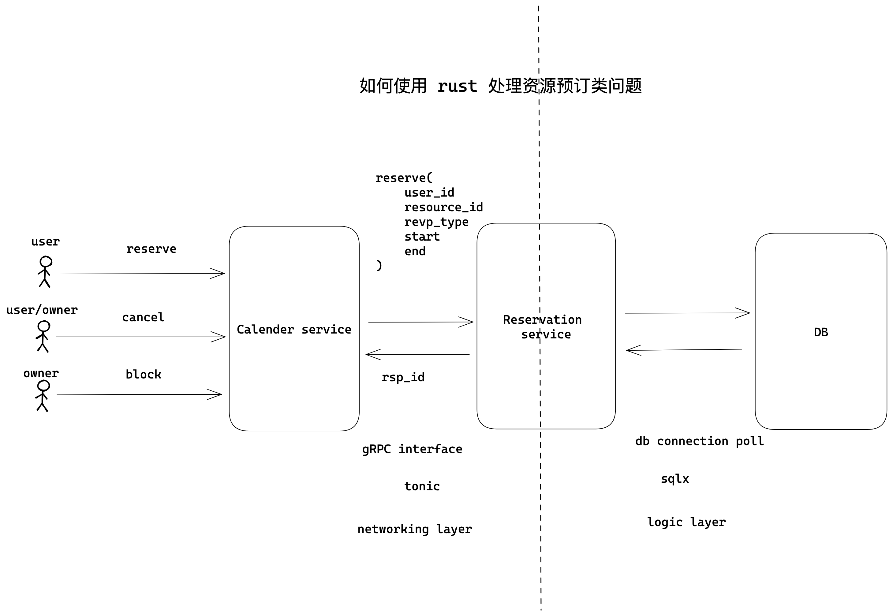
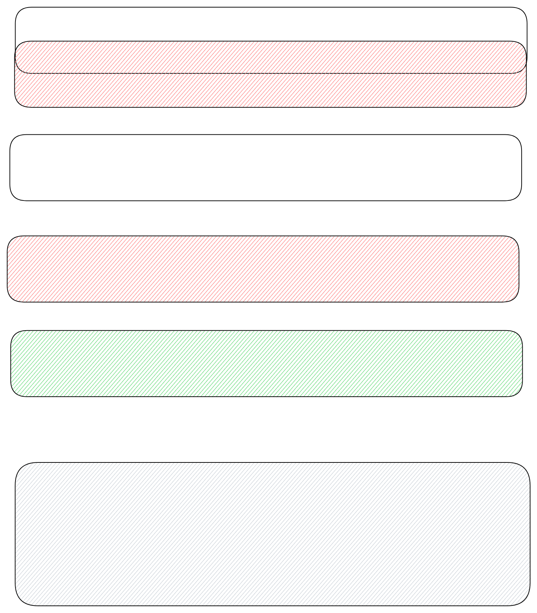

# Core Reservation Service

- Feature Name: core-reservation-service
- Start Date: 2024-01-07 19:23:10

## Summary

A core reservation services that solves the problem of reserving a resource for a period of time. We leverage postgres EXCLUDE constraints to ensure that only one reservation can be made for a given resource at a given time.

## Motivation

We need a common solution for various reservation requirements: 1) calender booking; 2) hotel/room booing; 3) meeting booking; 4) parking lot booking; 5) etc. Repeatedly building features for these requirements is a waste of time and resources. We need a common solution that can be used for all teams.

## Guide-level explanation

Basic architecture:



### Service interface

We would use gRPC as a service interface. Below is the proto definition:

```proto
 syntax = "proto3";

package reservation;

import "google/protobuf/timestamp.proto";


enum ReservationStatus {
  RESERVATION_STATUS_UNKNOWN = 0;
  RESERVATION_STATUS_PENDING = 1;
  RESERVATION_STATUS_CONFIRMED = 2;
  RESERVATION_STATUS_BLOCKED = 3;
}

enum ReservationType {
  RESERVATION_TYPE_UNKNOWN = 0;
  RESERVATION_TYPE_CREATE = 1;
  RESERVATION_TYPE_UPDATE = 2;
  RESERVATION_TYPE_DELETE = 3;
}

message Reservation {
  string id = 1;
  string resource_id = 2;
  string user_id = 3;

  ReservationStatus status = 4;
  google.protobuf.Timestamp start = 5;
  google.protobuf.Timestamp end = 6;
  string note = 7;
}

message ReserveRequest {
  Reservation reservation = 1;
}

message ReserveResponse {
  Reservation reservation = 1;
}

message updateRequest {
  ReservationStatus status = 1;
  string note = 2;
}

message UpdateResponse {
  Reservation reservation = 1;
}

message ConfirmRequest {
  string id = 1;
}

message ConfirmResponse {
  Reservation reservation = 1;
}

message CancelRequest {
  string id = 1;
}

message CancelResponse {
  Reservation reservation = 1;
}

message GetRequest {
  string id = 1;
}

message GetResponse {
  Reservation reservation = 1;
}

message QueryRequest {
  string resource_id = 1;
  string user_id = 2;

  // use status to filter result, If UNKNOWN return all reservations
  ReservationStatus status = 3;
  google.protobuf.Timestamp start = 4;
  google.protobuf.Timestamp end = 5;
}

message ListenRequest {}

message ListenResponse {
  ReservationType op = 1;
  Reservation reservation = 2;
}

service ReservationService {
  rpc reserve(ReserveRequest) returns (ReserveResponse);
  rpc confirm(ConfirmRequest) returns (ConfirmResponse);
  rpc update(updateRequest) returns (UpdateResponse);
  rpc cancel(CancelRequest) returns (CancelResponse);
  rpc get(GetRequest) returns (GetResponse);
  rpc query(QueryRequest) returns (stream Reservation);
  // another system can monitor the reservations and newly reserved/confirmed/canceled reservations
  rpc listen(ListenRequest) returns (stream ListenResponse);
}
```

### Database schema

We would use postgres as the database. Below is the schema:

```sql
CREATE SCHEMA rsvp;
CREATE TYPE rsvp.reservation_status AS ENUM (
  'unknown',
  'pending',
  'confirmed',
  'blocked'
);

CREATE TYPE rsvp.reservation_update_type AS ENUM (
  'unknown',
  'create',
  'update',
  'delete'
);

CREATE OR REPLACE FUNCTION rsvp.update_updated_at_column()
RETURNS TRIGGER AS $$
BEGIN
  NEW.updated_at = NOW();
  RETURN NEW;
END;
$$ LANGUAGE 'plpgsql';

CREATE TRIGGER update_updated_at BEFORE UPDATE ON rsvp.reservation
FOR EACH ROW EXECUTE PROCEDURE rsvp.update_updated_at_column();

CREATE TABLE rsvp.reservation (
  id UUID NOT NULL DEFAULT uuid_generate_v4(),
  resource_id varchar(64 ) NOT NULL,
  user_id varchar(64) NOT NULL,
  status rsvp.reservation_status NOT NULL DEFAULT 'pending',
  timespan tstzrange NOT NULL,
  note text,
  created_at TIMESTAMPTZ NOT NULL DEFAULT NOW(),
  updated_at TIMESTAMPTZ,

  CONSTRAINT reservation_pkey PRIMARY KEY (id),
  CONSTRAINT reservations_conflict EXCLUDE USING gist (resource_id WITH =, timespan WITH &&)
);

CREATE INDEX reservation_resource_id_idx ON rsvp.reservation (resource_id);
CREATE INDEX reservation_user_id_idx ON rsvp.reservation (user_id);

-- if user_id is null, then return all reservations within the during
-- if resource_id is null, then return all reservations within the during
-- if both are null, then return all reservations within the during
-- if both set, then return all reservations within the during for the resource and user
CREATE OR REPLACE FUNCTION rsvp.query(user_id varchar(64), resource_id varchar(64), during tstzrange) RETURNS TABLE rsvp.reservation AS $$ $$ LANGUAGE plpgsql;

-- reservation change queue
CREATE TABLE rsvp.reservation_change (
  id SERIAL NOT NULL,
  reservation_id varchar(64) NOT NULL,
  op rsvp.reservation_update_type NOT NULL,
);

-- trigger for add/update/delete reservation
CREATE OR REPLACE FUNCTION rsvp.reservation_trigger() RETURNS TRIGGER AS $$
BEGIN
  IF (TG_OP = 'INSERT') THEN
    INSERT INTO rsvp.reservation_change (reservation_id, op) VALUES (NEW.id, 'create');
  ELSIF (TG_OP = 'UPDATE') THEN
    IF (OLD.status <> NEW.status) THEN
      INSERT INTO rsvp.reservation_change (reservation_id, op) VALUES (NEW.id, 'update');
    END IF;
  ELSIF (TG_OP = 'DELETE') THEN
    INSERT INTO rsvp.reservation_change (reservation_id, op) VALUES (OLD.id, 'delete');
  END IF;
  -- notify a channel called reservation_update
  NOTIFY reservation_update;
  RETURN NULL;
END;
$$ LANGUAGE plpgsql;

CREATE TRIGGER reservation_trigger AFTER INSERT OR UPDATE OR DELETE ON rsvp.reservation
FOR EACH ROW EXECUTE PROCEDURE rsvp.reservation_trigger();
```

Here we use EXCLUDE constraint provide by postgres to ensure that verlapping reservations cannot be made for a given resource at a given time.

```sql
 CONSTRAINT reservations_conflict EXCLUDE USING gist (resource_id WITH =, timespan WITH &&)
```



We also use a trigger to notify a channel when a reservation is added/updated/deleted. To make sure even we missed certain messages from the channel when DB connection is down for some reason, we use a queue to store reservation changes. Thus when we receive a notification, we can query the queue to get all the changes since last time we checked, and once we finished processing all the changes, we can delete them from the queue.

### Core flow


## Reference-level explanation

TBD

## Drawbacks

N/A

## Rationale and alternatives

N/A

## Prior art

N/A

## Unresolved questions

- how to handle repeated reservation? - is this more ore less a business logic which shouldn't be put into this layer? (non-goal: we consider this is a business logic and should be handled by the caller)
- if load is big, we may use an external queue for recording changes.
- we haven't considered tracking/observability/deployment yet.
- query performance might be an issue - need to revisit the index and also consider using cache.

## Future possibilities

TBD
